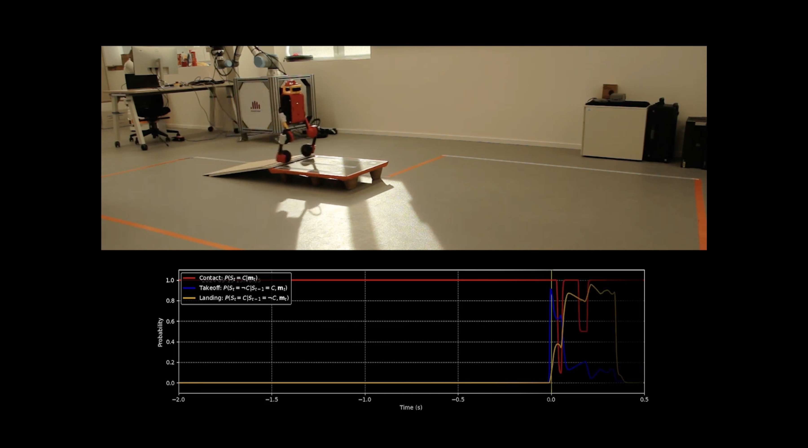
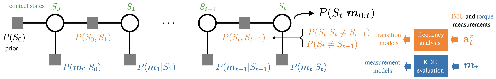

# A Data-driven Contact Estimation Method for Wheeled-Biped Robots
[](https://github.com/ubgk/contact_agent/actions/workflows/ci.yml)
[](https://coveralls.io/github/ubgk/contact_agent)

[](https://www.youtube.com/watch?v=QemngyjAQVU)

This project implements a Bayesian filter for estimating the contact state of [Upkie](https://github.com/upkie/upkie), a fully open-source wheeled-biped. Check out the [video](https://www.youtube.com/watch?v=QemngyjAQVU).

## Overview

We use Bayesian filtering to estimate the posterior probability $P(S_t|m_{0:t})$ of being in contact state $S_t$ given measurements $m_{0:t}$. Internally, measurement probabilities $P(m_t|S_t)$ are estimated by kernel density estimation (KDE) from knee and wheel torque sensors, while transition probabilities are estimated from IMU measurements through frequency analysis.

The contact filter is implemented in:
```
observers/
|- ContactFilter.cpp
|- MeasurementModel.cpp
|- TransitionModel.cpp
```

## Usage
The contact filter is integrated into the *spines* provided in this project. You should either run `bullet_spine` for simulation or `pi3hat_spine` on the real robot. Please refer to the [official documentation](https://upkie.github.io/upkie/spines.html) for more details on *spines* and *agents*. 

## TLDR
We provide a convenvience Make recipe to launch simulated environments:

```
make run_agent
```

*or* specify one of the environments:

```
make run_agent ENVIRONMENT=[stairs|track]
```

The recipe will launch both a C++ spine and a Python MPC balancer agent.

### Visualization 
You can visualize the spine logs using [**foxplot**](https://github.com/stephane-caron/foxplot):

```
make visualize
```

This command will visualize the latest mpack log file in your `/tmp/` directory.

### Offline Filtering
If you have an existing Upkie `.mpack` log file, you can alternatively use the replay tool:
```bash
$ ./tools/bazelisk run //observers:replay -- input.mpack [output.mpack]
```
which will process your log file offline and write the results to the output destination.

## Dependencies
This project depends on other open-source software (listed in alphabetical order, excluding transitive dependencies):

- [**btwxt**](https://github.com/bigladder/btwxt) for KDE interpolation to lookup measurement likelihoods,
- [**cnpy**](https://github.com/rogersce/cnpy) to read `.npz` files and deserialize the KDEs,
- [**foxplot**](https://github.com/stephane-caron/foxplot) to visualize `.mpack` files,
- [**mpacklog.cpp**](https://github.com/upkie/mpacklog.cpp) C++ library to log dictionaries into `.mpack` files,
- [**kissfft**](https://github.com/mborgerding/kissfft) for efficient fast Fourier transforms (FFT) to compute transition probabilities,
- [**Upkie**](https://github.com/upkie/upkie) as the robotic platform.

Like the rest of the Upkie project, we use [**Bazel**](http://Bazel.build) as our build system.